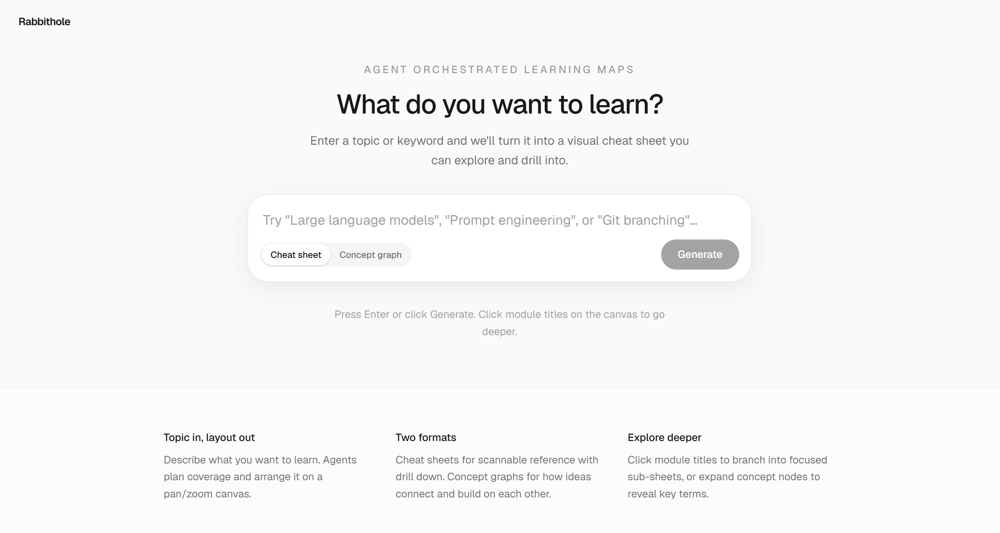

# Rabbithole

Ever chase a question so far you forget what you were trying to learn? Rabbithole is built around the opposite instinct: show the whole domain first, then let people drill in. It's an agent-orchestrated experiment in "study guides with better UX." Cheat sheet mode for scannable reference, concept graph mode for how ideas connect, and more formats planned as we figure out what helps people orient fastest.



Built with Cursor agents on a pan/zoom canvas. **Try it live:** [rabbithole-dusky.vercel.app](https://rabbithole-dusky.vercel.app)

## Formats


| Format            | Style key    | What you get                                                                                     |
| ----------------- | ------------ | ------------------------------------------------------------------------------------------------ |
| **Cheat sheet**   | `cheatsheet` | Scannable modules with tables, diagrams, and math — click module titles to drill into sub-sheets |
| **Concept graph** | `roadmap`    | Interactive DAG of concepts and prerequisites — click nodes to expand key terms                  |


Generation streams partial results to the UI so the canvas fills in progressively (skeleton → sections/nodes → final layout).

## Architecture

```
User topic
    ↓
POST /api/cheat-sheet/stream
    ↓
Planner agent (style-specific playbook in knowledge/)
    ↓
Writer agents (parallel section/node writers)
    ↓
Render contract (JSON tree) → React canvas
```

- **Agents** — `lib/cheat-sheet/orchestrate.ts` runs planner + writer agents via `@cursor/sdk` (local or cloud runtime).
- **Playbooks** — `knowledge/cheat-sheet/` holds planner/writer prompts and coverage rules per style.
- **Render contract** — `lib/cheat-sheet/render-contract.ts` defines the JSON tree schema; `lib/cheat-sheet/render-node.tsx` renders cheat sheets.
- **Concept graph** — `lib/cheat-sheet/concept-graph.ts` + `@xyflow/react` power the roadmap view (`components/cheat-sheet/RoadmapFlowView.tsx`).
- **Canvas** — Cheat sheets use a custom pan/zoom viewport; concept graphs use React Flow with measured auto-layout.

## Project layout

```
app/
  page.tsx                  # Landing page with topic composer
  cheat-sheet/page.tsx      # Main workspace (header, canvas, drill-down nav)
  api/cheat-sheet/          # REST + SSE streaming endpoints
components/cheat-sheet/     # Canvas, nodes, toolbar, style picker
lib/cheat-sheet/            # Orchestration, parsing, layout, fixtures
lib/agent-client.ts         # Cursor SDK setup (incl. Vercel /tmp HOME fix)
knowledge/cheat-sheet/      # Agent playbooks and coverage docs
scripts/cheat-sheet-e2e.ts  # End-to-end agent pipeline test
```

## Getting started

Requires [pnpm](https://pnpm.io/installation) (see `packageManager` in `package.json`).

Native deps (`sharp`, `sqlite3` for `@cursor/sdk`) are allowlisted in `[pnpm-workspace.yaml](pnpm-workspace.yaml)`.

```bash
pnpm install
cp .env.example .env.local
# Set CURSOR_API_KEY in .env.local for agent generation
pnpm dev
```

Open [http://localhost:3000](http://localhost:3000) or go directly to [http://localhost:3000/cheat-sheet](http://localhost:3000/cheat-sheet).

- **Load fixture** — preview the Git rebase sample (cheat sheet or roadmap, depending on Style).
- **Generate** — runs style-specific planners and writers via `@cursor/sdk`.

## Scripts

```bash
pnpm dev      # development server
pnpm build    # production build (webpack)
pnpm start    # serve production build
pnpm lint     # ESLint
pnpm test:cheat-sheet:json   # JSON extract / layout unit tests (no API key)
pnpm test:cheat-sheet:e2e    # full agent pipeline (requires CURSOR_API_KEY in .env)
```

E2E options:

```bash
pnpm test:cheat-sheet:e2e -- --topic "git rebase" --style cheatsheet
pnpm test:cheat-sheet:e2e -- --topic "git rebase" --style roadmap
```

Legacy `--depth` is accepted and maps to cheat sheet style.

## Environment


| Variable               | Description                                |
| ---------------------- | ------------------------------------------ |
| `CURSOR_API_KEY`       | Server-only; required for agent generation |
| `CURSOR_AGENT_RUNTIME` | Optional: `local` (default) or `cloud`     |


### Vercel

Production: [rabbithole-dusky.vercel.app](https://rabbithole-dusky.vercel.app).

Local agents need a writable `HOME`. On Vercel, `lib/agent-client.ts` redirects `HOME` and `TMPDIR` to `/tmp` at startup (dashboard `HOME` overrides are blocked). The Linux native SDK binary (`@cursor/sdk-linux-x64`) is bundled via `serverExternalPackages`. Agent state in `/tmp` is ephemeral per invocation.

## Stack

Next.js 16 · React 19 · Tailwind CSS 4 · `@cursor/sdk` · `@xyflow/react` · Mermaid · KaTeX